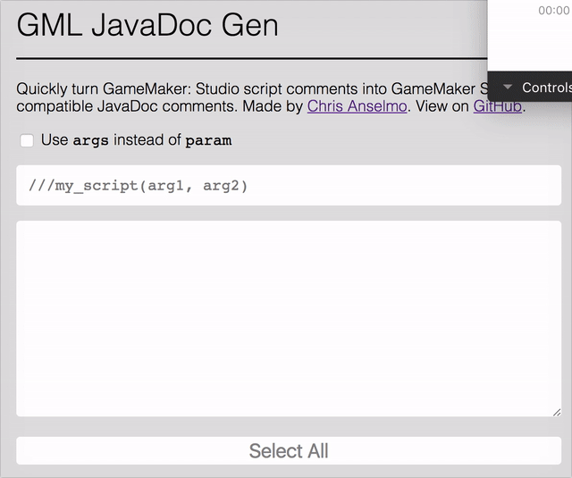

⚠️ [This project has moved!](https://github.com/christopherwk210/tophers-tools/tree/master/src/app/components/tools/game-maker/gml-javadoc-gen)

# GML JavaDoc Gen
Quickly turn GameMaker: Studio script comments into GameMaker Studio 2 compatible JavaDoc comments.

  

[Click Here](https://christopherwk210.github.io/gml-javadoc-gen/) to view it live!

Big thanks to [YoYo Games](https://twitter.com/YoYoGames) for the [Twitter shoutout](https://twitter.com/YoYoGames/status/825031998636978176)!

# About
I made this quickly because I was tired of typing these out when I copied old scripts from GM: S. What can I say, I'm lazy. Made in good old reliable JavaScript, no framework needed.
